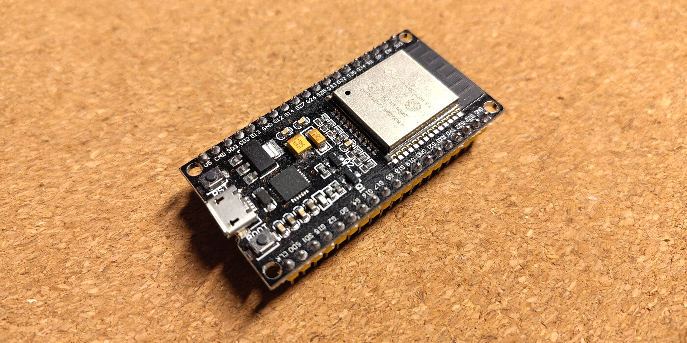
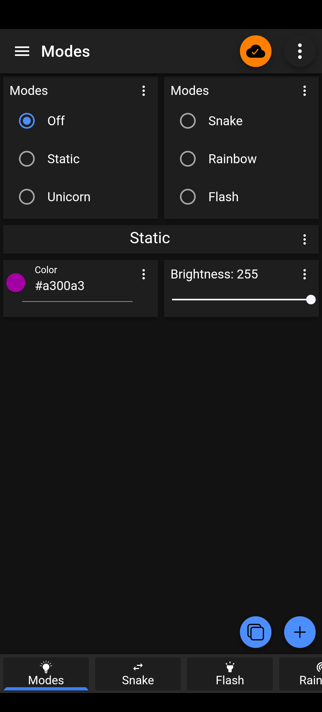
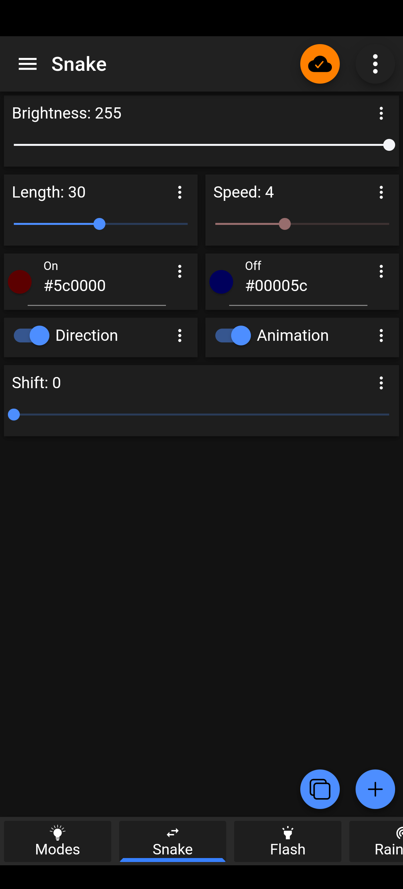
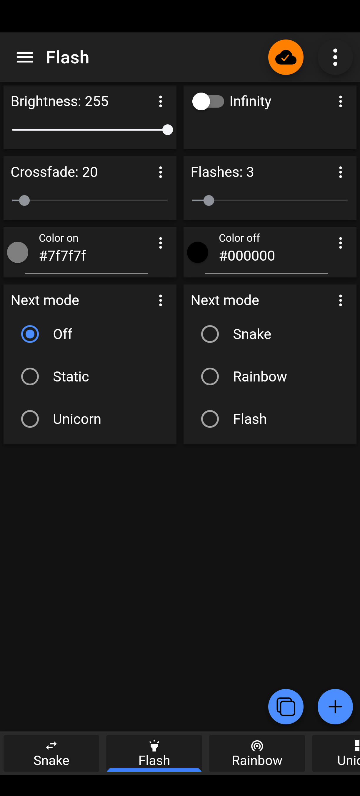
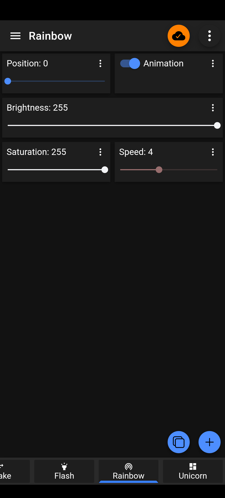
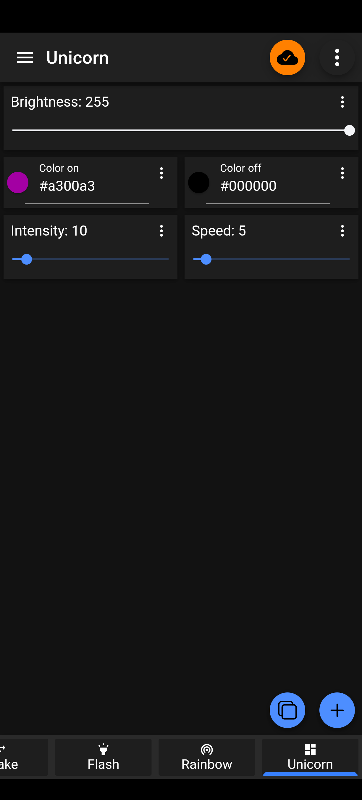
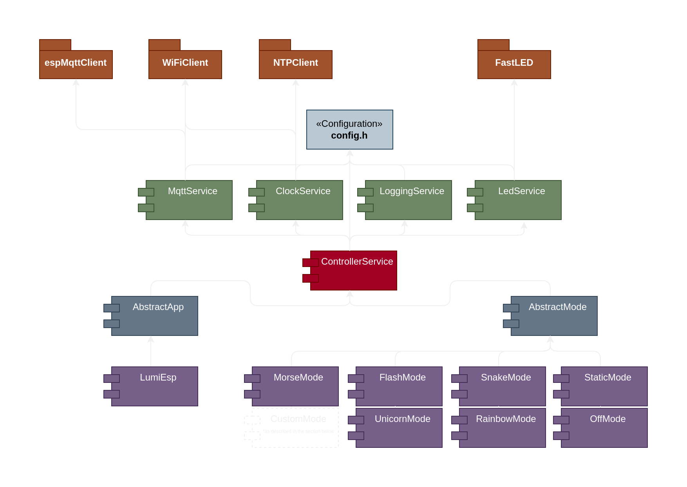

# LumiESP
LumiESP is a project utilizing an ESP32 microcontroller to control an LED strip via MQTT. It is designed for easy customization and extension, enabling the creation of custom modes and settings. The included Makefile streamlines PlatformIO commands for building, uploading, and monitoring the code.

<table>
  <tr>
    <td></td>
    <td></td>
    <td></td>
    <td></td>
  </tr>
</table>

*Example modes: Flash, Rainbow, Snake, and Unicorn*

> **Note:** This project is in active development and may have bugs or incomplete features. Please report any issues you encounter.

## What are the ESP32 and MQTT?
The ESP32 is a powerful, low-cost microcontroller with integrated Wi-Fi and Bluetooth, making it perfect for IoT (*Internet of Things*) applications. It enables devices to connect to the internet and interact wirelessly. MQTT (*Message Queuing Telemetry Transport*) is a lightweight protocol designed for reliable messaging between devices, especially in low-bandwidth or resource-constrained environments. It allows efficient, real-time communication by transmitting messages between devices over a network, making it an ideal choice for IoT systems.



## Features
- Control LED strips with the ESP32 via MQTT (supports LED types like `WS2812`, `WS2812B`, `WS2813`, etc.)
- Customizable settings for WiFi, MQTT, device, and LED strip configurations (see the [Configuration](#3-configure-the-project) section)
- Simplified build, upload, and monitoring with PlatformIO commands
- Compatible with the `IoT MQTT Panel` app for easy LED strip control using a pre-configured panel
- Ability to define and implement custom modes for LED strips (see the [Custom Modes](#define-your-own-custom-modes) section)
- I hope a good documentation and a good code structure

## Requirements
- An ESP32 microcontroller (e.g., `ESP32 Dev Module`)
- A compatible LED strip (e.g., `WS2812`, `WS2812B`, `WS2813`)
- PlatformIO installed on your system, or use the provided [nix-shell](/shell.nix)
- MQTT broker (e.g., `Mosquitto`)

*Some recommended tools and software:*
- [MQTT Explorer](https://mqtt-explorer.com/) app for monitoring MQTT messages
- [IoT MQTT Panel](https://play.google.com/store/apps/details?id=snr.lab.iotmqttpanel.prod) app for controlling the LED strip via MQTT
- [Docker](https://www.docker.com/) for running a local MQTT broker

## Installation
### 1. Install PlatformIO
PlatformIO is a cross-platform code builder and an easy way to manage embedded software environments. Follow the official [installation guide](https://docs.platformio.org/en/latest/core/installation/methods/installer-script.html) to set it up.

> **Note:** NixOS users can use the included `shell.nix` to enter a shell with PlatformIO pre-installed.

### 2. Clone the Repository
Clone the LumiESP project to your local machine:

```bash
git clone https://github.com/friedjof/lumiESP.git
cd LumiESP
```

### 3. Configure the Project
Before using LumiESP, ensure the following key settings in `config/config.h` are properly configured:

#### WiFi Configuration
- `WIFI_SSID`: Your WiFi network name.
- `WIFI_PASSWORD`: Your WiFi password.

#### MQTT Configuration
- `MQTT_BROKER`: Address of your MQTT broker.
- `MQTT_PORT`: Typically set to `1883`.
- `MQTT_USERNAME`: MQTT broker username.
- `MQTT_PASSWORD`: MQTT broker password.
- `MQTT_CLIENT_ID`: Unique client ID for the ESP32, critical for distinguishing your device on the network and avoiding conflicts if multiple devices are connected.

#### Device Configuration
- `DEVICE_NAME`: Unique name for your device (used in MQTT topics and communication). Ensure it’s unique if you have multiple devices to prevent overlap or topic collisions.
- `DEVICE_LOCATION`: Optional, e.g., "Living Room".

#### LED Configuration
- `LED_TYPE`: Type of LED strip (e.g., `WS2812`).
- `LED_PIN`: GPIO pin connected to the strip.
- `LED_NUM_LEDS`: Number of LEDs in the strip.

Make sure these settings are tailored to your setup for proper operation of LumiESP. A unique device name and MQTT client ID are crucial for seamless communication, especially in setups with multiple devices.

### 4. Build, Upload, and Monitor
Use the Makefile to simplify PlatformIO commands. Edit variables in the Makefile as needed.

> **Note:** Copy `config/config.h-template` to `config/config.h` and add your details, or use `setup.py` (`python setup.py` or `make setup`).

#### Variables
- `PORT`: ESP32 serial port (e.g., `/dev/ttyUSB0`).
- `BOARD`: ESP32 board type (e.g., `esp32dev`).
- `SPEED`: Baud rate for the serial monitor (e.g., `115200`).

### 5. Control the LED Strip via MQTT with the IoT MQTT Panel App
It takes some time to configure a good panel for controlling the LED strip. Therefore, I have used the [IoT MQTT Panel](https://play.google.com/store/apps/details?id=snr.lab.iotmqttpanel.prod) app to control the LED strip. The app is easy to use and allows you to customize the panel according to your needs. You can see some screenshots of the panel below and a tutorial on how to load the `panel.json` configuration file.

<table>
  <tr>
    <td></td>
    <td></td>
    <td></td>
    <td></td>
    <td></td>
  </tr>
</table>

This panel allows you to control the LED strip using MQTT messages. You can set the color, brightness, and mode of the LED strip using the app.
If you would like to use the samen panel, you can download the app from the [Google Play Store](https://play.google.com/store/apps/details?id=snr.lab.iotmqttpanel.prod) and load this [panel.json](media/iot-mqtt-panel/panel.json) configuration file.

To load the `panel.json` configuration file, follow these steps:
1. Open the IoT MQTT Panel app on your device
2. Create a new connection to your MQTT broker
3. Click on the three dots of the created connection
4. Select the "share" option
5. Configure a mqtt topic and click "subscribe and wait"
6. Open the "MQTT Explorer" on your desktop
7. Copy the JSON configuration from the `panel.json` file
8. Publish the JSON configuration to the topic you have configured in the app

### Development Environment
You can run a `mosquitto` MQTT broker locally on your machine for testing. To run the MQTT broker using Docker, follow these steps:

> **Note:** Make sure you have Docker installed on your system and you are in the root directory of this project.

Setup the username and password for the MQTT broker (replace `<username>` with your desired username e.g., `esp`):
```bash
docker run -it -v ./mosquitto/config:/mosquitto/config eclipse-mosquitto mosquitto_passwd -c /mosquitto/config/password.txt <username>
```

Start the MQTT broker
```bash
docker compose up -d
```

#### The Makefile provides the following commands:
Configure the Makefile variables to match your setup:
- **PORT**: The serial port of the ESP32.
- **BOARD**: The ESP32 board type.
- **SPEED**: The baud rate for the serial monitor.
- **PLATFORMIO**: The path to the PlatformIO executable.

The Makefile provides the following commands:
- **Build the project:** `make build`
- **Upload the code to the ESP32:** `make upload`
- **Monitor the serial output:** `make monitor`
- **Clean the build files:** `make clean`
- **Setup the repository:** `make setup`
- **Clean, build, flash, and open the serial monitor:** `make flash`
- **print the help message:** `make help`

## MQTT Topics
```txt
LumiESP
├── LumiEsp     // this defines the system topic
│   ├── sub
│   │   ├── status     // the system status
│   │   ├── datetime   // the current date and time
│   │   ├── log        // the log message
│   │   ├── level      // the log level
│   │   └── mode       // the current mode
│   └── pub
│       └── mode       // set the new mode
├── StaticMode  // this is a basic mode that sets the LED strip to a static color
│   ├── sub
│   │   ├── brightness // the current brightness
│   │   └── hex        // the current color in hex format
│   └── pub
│       ├── brightness // set the new brightness
│       └── hex        // set the new color in hex format
…
```

The system topic is used to handle system-related information, such as the current mode, status updates, and log messages, using the publish/subscribe (pub/sub) pattern. When a change, like a new color or brightness, is set, the ESP32 publishes the updated values back to the `sub` topic to confirm the changes. This ensures that any subscribers to the `sub` topics receive the latest values and can track the current system status.

> **Hint:** You can see more topics in this [MQTT Explorer screenshot](media/images/demo/screenshorts/mqtt-explorer_topics.png)

## Define Your Own Custom Modes

> **Note:** You need basic knowledge of C++ (*Abstract* Classes, Inheritance, and Function Binding) to define custom modes.

You can define your own custom modes by following steps:
1. Create a new folder, such as `ModeCustom`, in the `lib/` directory.
2. Inside this folder, create a header file named `CustomMode.h` and a source file named `CustomMode.cpp`.
3. Implement the `CustomMode` class in these files, using the `AbstractMode` class as the base class.


### `CustomMode.h`
```cpp
// #ifndef is a preprocessor directive that checks if the token has been defined earlier in the file or in an included file
#ifndef CUSTOMMODE_H
#define CUSTOMMODE_H

#include <functional>
#include "AbstractMode.h"

class CustomMode : public AbstractMode {
private:
    // Internal properties for managing color and brightness
    String customColor = "#424242";  // Default color
    String newCustomColor = this->customColor;
    byte customBrightness = 255;  // Default brightness
    byte newCustomBrightness = this->customBrightness;

    // Callback method called when a new color is set via MQTT
    void customColorCallback(const String &color);
    // Callback method called when a new brightness is set via MQTT
    void customBrightnessCallback(const byte &brightness);

    // Functions to publish updated values back to MQTT to confirm changes
    std::function<void(String payload)> pushCustomColor = nullptr;
    std::function<void(String payload)> pushCustomBrightness = nullptr;

    // Helper methods to detect changes in color or brightness
    bool isNewCustomColor();
    bool isNewCustomBrightness();

public:
    CustomMode(ControllerService* controllerService);

    // Setup method called once when the mode is initialized
    void customSetup() override;

    // Loop method called in every iteration; 'steps' is a counter for every mode in this project
    void customLoop(unsigned long long steps) override;
};

#endif
```

### `CustomMode.cpp`
```cpp
// Include the header file of the custom mode
#include "CustomMode.h"

// Constructor implementation of the custom mode
// Calls the base class "AbstractMode" constructor with the "controllerService" parameter
CustomMode::CustomMode(ControllerService* controllerService) : AbstractMode(controllerService) {
    // Parameters for classifying the mode; provide basic info about the mode and author
    this->modeTitle = "Custom Mode";
    this->modeDescription = "This is a custom mode that sets the LED strip to a custom color and brightness.";
    this->modeInternalName = "CustomMode"; // Unique name to identify the mode
    this->modeAuthor = "<Your Name>";      // Add your name or username
    this->modeContact = "<Your Email or other contact information (optional)>";
    this->modeVersion = "1.0.0";           // Define a version number
    this->modeLicense = "MIT";             // Define your chosen license
}

void CustomMode::customSetup() {
    // Called once when the mode is initialized
    // Define MQTT topics to push and subscribe to

    // Note: "controllerService" manages other services and is accessed via "AbstractMode"
    // Refer to the "Services and Classes" section diagram for more details

    // Topic for color: "<DeviceName>/<ModeInternalName>/sub/customcolor" and "<DeviceName>/<ModeInternalName>/pub/customcolor"
    // Uses parameters like modeInternalName, topicName, defaultValue, payloadType, and callback
    this->pushCustomColor = this->controllerService->subscribeModeTopic(
        this->modeInternalName, "customcolor", this->customColor.c_str(), payload_e::COLOR,
        std::function<void(String)>(std::bind(&CustomMode::customColorCallback, this, std::placeholders::_1)));
    
    // Topic for brightness: "<DeviceName>/<ModeInternalName>/sub/custombrightness" and "<DeviceName>/<ModeInternalName>/pub/custombrightness"
    // Uses parameters including boundaries (min, max)
    this->pushCustomBrightness = this->controllerService->subscribeModeTopic(
        this->modeInternalName, "custombrightness", this->customBrightness, boundaries_t{0, 255},
        payload_e::BYTE, std::function<void(String)>(std::bind(&CustomMode::customBrightnessCallback, this, std::placeholders::_1)));
}

void CustomMode::customLoop(unsigned long long steps) {
    // Called in every loop iteration; defines the mode's behavior

    // Check if it's the first run after activation using "isFirstRun()" from "AbstractMode"
    if (this->isFirstRun()) {
        // Update the LED strip from the state of the last mode
        this->controllerService->setHexColor(this->customColor);
        this->controllerService->setBrightness(this->customBrightness);
        this->controllerService->confirmLedConfig(); // Confirm new configuration
    }

    // Use conditions to handle new configurations set via MQTT; this reduces loop execution time
    if (this->isNewCustomColor()) {
        this->customColor = this->newCustomColor;
        this->controllerService->setHexColor(this->customColor);
        this->controllerService->confirmLedConfig();
    }

    if (this->isNewCustomBrightness()) {
        this->customBrightness = this->newCustomBrightness;
        this->controllerService->setBrightness(this->customBrightness);
        this->controllerService->confirmLedConfig();
    }

    // Use the "steps" parameter for animations or implement a custom counter for updates
}

// Called when a new color is set via MQTT
void CustomMode::customColorCallback(const String &color) {
    this->newCustomColor = color;                // Store the new color

    if (this->pushCustomColor != nullptr) {
        this->pushCustomColor(this->newCustomColor); // Acknowledge the change to the MQTT broker if the callback is set
    }
}

// Called when a new brightness is set via MQTT
void CustomMode::customBrightnessCallback(const byte &brightness) {
    this->newCustomBrightness = brightness;                // Store the new brightness
    
    if (this->pushCustomBrightness != nullptr) {
        this->pushCustomBrightness(this->newCustomBrightness); // Acknowledge the change to the MQTT broker if the callback is set
    }
}

// Checks if the color has changed
bool CustomMode::isNewCustomColor() {
    return this->customColor != this->newCustomColor;
}

// Checks if the brightness has changed
bool CustomMode::isNewCustomBrightness() {
    return this->customBrightness != this->newCustomBrightness;
}
```

4. Include the New Mode in the `main.cpp` File:
```cpp
//…

// Include custom modes
#include "CustomMode.h"
//…

// Main setup method of the ESP32
void setup() {
    //…
    // ----> SETUP YOUR MODE HERE <----
    // Define your custom modes here
    AbstractMode* customMode = new CustomMode(&controllerService);
    //…

    // Setup modes
    // Calls the "setup" method of the "AbstractMode" class followed by "customSetup"
    customMode->setup();
    //…
    // <---- SETUP YOUR MODE HERE ---->

    //…
}

//…
```
5. Build, upload, and monitor the code using the Makefile commands ([see above](#makefile)).

> I'd love to see the custom modes you create—feel free to share them via a pull request!

## Services and classes
- **ClockService**: Provides timekeeping functionality (including NTP synchronization).
- **LoggingService**: Logs messages to the serial monitor and MQTT.
- **MQTTService**: Handles MQTT communication with the broker.
- **LedService**: Controls the LED strip using PWM signals.
- **ControllerService**: Manages tasks and schedules for the ESP32.



## Troubleshooting
- Make sure the correct port is selected in the Makefile.
- Ensure PlatformIO is installed correctly by checking the installation instructions linked above (see [Installation](#installation)).
- Check if the `DEVICE_NAME` are unique if you have multiple devices (see the [Configuration](#3-configure-the-project) section).
- Check if the `DEVICE_CLIENT_ID` is unique for each device (see the [Configuration](#3-configure-the-project) section).
- Verify that the MQTT broker is running and accessible from the ESP32.

> **Note:** If you encounter any issues, please open an issue on the GitHub repository and I hope I can help you.

## Acknowledgements
- PlatformIO for providing a versatile environment for embedded development.
- MQTT protocol for enabling efficient communication between devices.

## Author
- [Friedjof Noweck](https://github.com/Friedjof)

*Looking forward to seeing your name here soon.*
