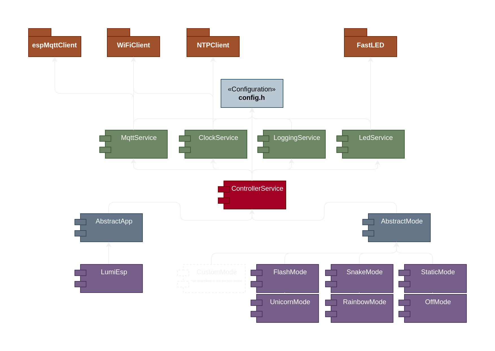

# LumiESP
LumiESP is a project utilizing an ESP32 microcontroller to control an LED strip via MQTT. It is designed for easy customization and extension, enabling the creation of custom modes and settings. The included Makefile streamlines PlatformIO commands for building, uploading, and monitoring the code.

> **Note:** This project is still in development and may contain bugs or incomplete features. Please report any issues you encounter.

## What is the ESP32 and MQTT?
The ESP32 is a versatile, low-cost microcontroller with built-in Wi-Fi and Bluetooth capabilities, making it ideal for IoT (Internet of Things) projects. It allows devices to connect to the internet and communicate wirelessly. MQTT (Message Queuing Telemetry Transport) is a lightweight messaging protocol designed for small sensors and mobile devices. It enables efficient communication between devices by sending and receiving messages over a network.

## Features
- Control LED strips using the ESP32 over MQTT (e.g., LED strips like `WS2812`, `WS2812B`, `WS2813`, etc.)
- Customizable settings for LED strips, such as brightness and color and custom modes
- Simplified build, upload, and monitoring process using PlatformIO commands
- Ability to define custom modes and settings for the LED strips

## Requirements
- ESP32 microcontroller (e.g., ESP32 Dev Module)
- PlatformIO installed on your system or simply use this [nix-shell](/shell.nix)
- LED strip (e.g., WS2812, WS2812B, WS2813)
- MQTT broker (e.g., Mosquitto)

## Installation
### 1. Install PlatformIO
PlatformIO is a cross-platform code builder and the easiest way to manage your embedded software environment. To install PlatformIO, follow the official instructions found [here](https://docs.platformio.org/en/latest/core/installation/methods/installer-script.html).

> **Note:** If you are using NixOS, you can use the provided `shell.nix` file to enter a shell with PlatformIO installed.

### 2. Clone the Repository
Clone the LumiESP project repository to your local machine:

```bash
git clone https://github.com/friedjof/lumiESP.git
cd LumiESP
```

### 3. Build, Upload, and Monitor
The project includes a Makefile that simplifies the use of PlatformIO commands. Make sure to edit the variables in the Makefile according to your setup.

> **Note:** You have to copy the `config/config.h-template` to `config/config.h` and fill in the necessary information. You can also use the `setup.py` script to do this for you (run `python setup.py` or `make setup`).

#### Variables
- `PORT`: Serial port of your ESP32 (e.g., `/dev/ttyUSB0`).
- `BOARD`: The type of ESP32 board (e.g., `esp32dev`).
- `SPEED`: Baud rate for the serial monitor (e.g., `115200`).

### Development Environment
You can run a `mosquitto` MQTT broker locally on your machine for testing. To run the MQTT broker using Docker, follow these steps:

> **Note:** Make sure you have Docker installed on your system and you are in the root directory of this project.

Setup the username and password for the MQTT broker (replace `<username>` with your desired username e.g., `esp`):
```bash
docker run -it -v ./mosquitto/config:/mosquitto/config eclipse-mosquitto mosquitto_passwd -c /mosquitto/config/password.txt <username>
```

Start the MQTT broker
```bash
docker compose up -d
```

#### Makefile
- **Build the project:** `make build`
- **Upload the code to the ESP32:** `make upload`
- **Monitor the serial output:** `make monitor`
- **Clean the build files:** `make clean`
- **Setup the repository:** `make setup`
- **Clean, build, flash, and open the serial monitor:** `make flash`
- **print the help message:** `make help`

## MQTT Topics
```txt
LumiESP
├── LumiESP     // this defines the system topic
│   ├── sub
│   │   ├── status     // the system status
│   │   ├── datetime   // the current date and time
│   │   ├── log        // the log message
│   │   ├── level      // the log level
│   │   └── mode       // the current mode
│   └── pub
│       └── mode       // set the new mode
├── StaticMode  // this is a basic mode that sets the LED strip to a static color
│   ├── sub
│   │   ├── brightness // the current brightness
│   │   └── hex        // the current color in hex format
│   └── pub
│       ├── brightness // set the new brightness
│       └── hex        // set the new color in hex format
…
```

> **Note:** The system topic is used to publish and subscribe to system-related information, such as the current mode, status, and log messages. The other topics are used to control the LED strip and define custom modes.

## Define Your Own Custom Modes
You can easily define your own custom modes by following these steps:
1. Create a new folder, such as `ModeCustom`, in the `lib/` directory.
2. Inside this folder, create a header file named `CustomMode.h` and a source file named `CustomMode.cpp`.
3. Implement the `CustomMode` class in these files, using the `AbstractMode` class as the base class.

> `CustomMode.h`
```cpp
// #ifndef is a preprocessor directive that checks if the token has been defined earlier in the file or in an included file
#ifndef CUSTOMMODE_H
#define CUSTOMMODE_H

#include <functional>
#include "AbstractMode.h"

class CustomMode : public AbstractMode {
private:
    // Internal properties for managing color and brightness
    String customColor = "#424242";  // Default color
    String newCustomColor = this->customColor;
    byte customBrightness = 255;  // Default brightness
    byte newCustomBrightness = this->customBrightness;

    // Callback method called when a new color is set via MQTT
    void customColorCallback(const String &color);
    // Callback method called when a new brightness is set via MQTT
    void customBrightnessCallback(const byte &brightness);

    // Functions to publish updated values back to MQTT to confirm changes
    std::function<void(String payload)> pushCustomColor = std::bind(&CustomMode::customColorCallback, this, std::placeholders::_1);
    std::function<void(String payload)> pushCustomBrightness = std::bind(&CustomMode::customBrightnessCallback, this, std::placeholders::_1);

    // Helper methods to detect changes in color or brightness
    bool isNewCustomColor();
    bool isNewCustomBrightness();

public:
    CustomMode(ControllerService* controllerService);

    // Setup method called once when the mode is initialized
    void customSetup() override;

    // Loop method called in every iteration; 'steps' is a counter for every mode in this project
    void customLoop(unsigned long long steps) override;
};

#endif
```

> `CustomMode.cpp`
```cpp
// Include the header file of the custom mode
#include "CustomMode.h"

// Constructor implementation of the custom mode
// Calls the base class "AbstractMode" constructor with the "controllerService" parameter
CustomMode::CustomMode(ControllerService* controllerService) : AbstractMode(controllerService) {
    // Parameters for classifying the mode; provide basic info about the mode and author
    this->modeTitle = "Custom Mode";
    this->modeDescription = "This is a custom mode that sets the LED strip to a custom color and brightness.";
    this->modeInternalName = "CustomMode"; // Unique name to identify the mode
    this->modeAuthor = "<Your Name>";      // Add your name or username
    this->modeContact = "<Your Email or other contact information (optional)>";
    this->modeVersion = "1.0.0";           // Define a version number
    this->modeLicense = "MIT";             // Define your chosen license
}

void CustomMode::customSetup() {
    // Called once when the mode is initialized
    // Define MQTT topics to push and subscribe to

    // Note: "controllerService" manages other services and is accessed via "AbstractMode"
    // Refer to the "Services and Classes" section diagram for more details

    // Topic for color: "<DeviceName>/<ModeInternalName>/sub/customcolor" and "<DeviceName>/<ModeInternalName>/pub/customcolor"
    // Uses parameters like modeInternalName, topicName, defaultValue, payloadType, and callback
    this->pushCustomColor = this->controllerService->subscribeModeTopic(
        this->modeInternalName, "customcolor", this->customColor.c_str(), payload_e::COLOR,
        std::function<void(String)>(std::bind(&CustomMode::customColorCallback, this, std::placeholders::_1)));
    
    // Topic for brightness: "<DeviceName>/<ModeInternalName>/sub/custombrightness" and "<DeviceName>/<ModeInternalName>/pub/custombrightness"
    // Uses parameters including boundaries (min, max)
    this->pushCustomBrightness = this->controllerService->subscribeModeTopic(
        this->modeInternalName, "custombrightness", this->customBrightness, boundaries_t{0, 255},
        payload_e::BYTE, std::function<void(String)>(std::bind(&CustomMode::customBrightnessCallback, this, std::placeholders::_1)));
}

void CustomMode::customLoop(unsigned long long steps) {
    // Called in every loop iteration; defines the mode's behavior

    // Check if it's the first run after activation using "isFirstRun()" from "AbstractMode"
    if (this->isFirstRun()) {
        // Update the LED strip from the state of the last mode
        this->controllerService->setHexColor(this->customColor);
        this->controllerService->setBrightness(this->customBrightness);
        this->controllerService->confirmLedConfig(); // Confirm new configuration
    }

    // Use conditions to handle new configurations set via MQTT; this reduces loop execution time
    if (this->isNewCustomColor()) {
        this->customColor = this->newCustomColor;
        this->controllerService->setHexColor(this->customColor);
        this->controllerService->confirmLedConfig();
    }

    if (this->isNewCustomBrightness()) {
        this->customBrightness = this->newCustomBrightness;
        this->controllerService->setBrightness(this->customBrightness);
        this->controllerService->confirmLedConfig();
    }

    // Use the "steps" parameter for animations or implement a custom counter for updates
}

// Called when a new color is set via MQTT
void CustomMode::customColorCallback(const String &color) {
    this->newCustomColor = color;                // Store the new color
    this->pushCustomColor(this->newCustomColor); // Acknowledge the change
}

// Called when a new brightness is set via MQTT
void CustomMode::customBrightnessCallback(const byte &brightness) {
    this->newCustomBrightness = brightness;                // Store the new brightness
    this->pushCustomBrightness(this->newCustomBrightness); // Acknowledge the change
}

// Checks if the color has changed
bool CustomMode::isNewCustomColor() {
    return this->customColor != this->newCustomColor;
}

// Checks if the brightness has changed
bool CustomMode::isNewCustomBrightness() {
    return this->customBrightness != this->newCustomBrightness;
}
```

4. Include the New Mode in the `main.cpp` File:
```cpp
//…

// Include custom modes
#include "CustomMode.h"
//…

// Main setup method of the ESP32
void setup() {
    //…
    // ----> SETUP YOUR APP HERE <----
    // Define your custom modes here
    AbstractMode* customMode = new CustomMode(&controllerService);
    //…

    // Setup modes
    // Calls the "setup" method of the "AbstractMode" class followed by "customSetup"
    customMode->setup();
    //…
    // <---- SETUP YOUR APP HERE ---->

    //…
}

//…
```
5. Build, upload, and monitor the code using the Makefile commands ([see above](#makefile)).

## Services and classes
- **ClockService**: Provides timekeeping functionality (including NTP synchronization).
- **LoggingService**: Logs messages to the serial monitor and MQTT.
- **MQTTService**: Handles MQTT communication with the broker.
- **LedService**: Controls the LED strip using PWM signals.
- **ControllerService**: Manages tasks and schedules for the ESP32.



## Troubleshooting
- Make sure the correct port is selected in the Makefile.
- Ensure PlatformIO is installed correctly by checking the installation instructions linked above.

## Acknowledgements
- PlatformIO for providing a versatile environment for embedded development.
- MQTT protocol for enabling efficient communication between devices.

## Author
- [Friedjof Noweck](https://github.com/Friedjof)
