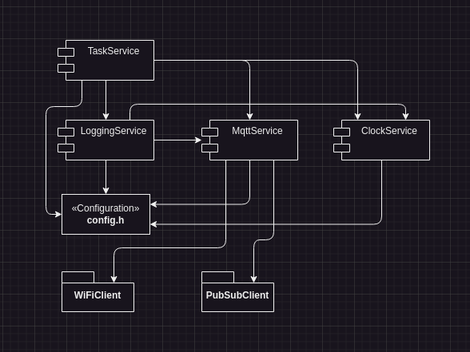

# LumiESP
LumiESP is a project that uses an ESP32 microcontroller to control a 12V LED strip via MQTT. The project is designed to provide flexible and remote control over lighting, allowing integration into home automation systems.

## Features
- Control 12V LED strip using ESP32 over MQTT
- Customizable settings for port, board, and speed
- Easy build, upload, and monitor using PlatformIO commands

## Requirements
- ESP32 microcontroller (e.g., ESP32 Dev Module)
- PlatformIO installed on your system
- LED strip (12V)
- MQTT broker (e.g., Mosquitto)

## Installation
### 1. Install PlatformIO
PlatformIO is a cross-platform code builder and the easiest way to manage your embedded software environment. To install PlatformIO, follow the official instructions found [here](https://docs.platformio.org/en/latest/core/installation/methods/installer-script.html).

### 2. Clone the Repository
Clone the LumiESP project repository to your local machine:

```bash
git clone https://github.com/friedjof/lumiESP.git
cd LumiESP
```

### 3. Build, Upload, and Monitor
The project includes a Makefile that simplifies the use of PlatformIO commands. Make sure to edit the variables in the Makefile according to your setup.

#### Variables
- `PORT`: Serial port of your ESP32 (e.g., `/dev/ttyUSB0`).
- `BOARD`: The type of ESP32 board (e.g., `esp32dev`).
- `SPEED`: Baud rate for the serial monitor (e.g., `115200`).

### Development Environment
You can run a `mosquitto` MQTT broker locally on your machine for testing. To install `mosquitto`, run the following commands:
Setup the username and password for the MQTT broker (replace `<username>` with your desired username e.g., `esp`):
```bash
docker run -it -v ./mosquitto/config:/mosquitto/config eclipse-mosquitto mosquitto_passwd -c /mosquitto/config/password.txt <username>
```

Start the MQTT broker
```bash
docker compose up -d
```

#### Makefile

- **Build the project:** `make build`
- **Upload the code to the ESP32:** `make upload`
- **Monitor the serial output:** `make monitor`
- **Clean the build files:** `make clean`
- **Setup the repository:** `make setup`
- **Clean, build, flash, and open the serial monitor:** `make flash`

### Repository structure
```txt
.
├── config
│   ├── config.h
│   └── config.h-template
├── include
│   └── README.md
├── lib
│   ├── ClockService
│   │   ├── ClockService.cpp
│   │   └── ClockService.h
│   ├── LoggingService
│   │   ├── LoggingService.cpp
│   │   └── LoggingService.h
│   ├── MQTTService
│   │   ├── MQTTService.cpp
│   │   └── MQTTService.h
│   ├── TaskService
│   │   ├── TaskService.cpp
│   │   └── TaskService.h
│   └── README.md
├── media
│   ├── drawio
│   │   └── sketches.drawio
│   └── images
│       └── services-overview.png
├── mosquitto
│   ├── config
│   │   └── mosquitto.conf
│   ├── data
│   └── log
├── src
│   └── main.cpp
├── test
│   └── README
├── .gitignore
├── compose.yml
├── Makefile
├── platformio.ini
├── README.md
└── setup.py
```

#### Services
- **ClockService**: Provides timekeeping functionality (including NTP synchronization).
- **LoggingService**: Logs messages to the serial monitor and MQTT.
- **MQTTService**: Handles MQTT communication with the broker.
- **TaskService**: Manages tasks and schedules for the ESP32.



## MQTT Topics
```txt
lumiESP
├── status
│   ├── msg
│   ├── datetime
│   ├── log
│   └── level
└── led
    ├── pub
    │   ├── mode
    │   ├── state
    │   ├── on
    │   │   ├── hex
    │   │   └── brightness
    │   ├── off
    │   │   ├── hex
    │   │   └── brightness
    │   ├── custom
    │   │   ├── hex
    │   │   └── brightness
    │   ├── blink
    │   │   ├── on
    │   │   │   ├── hex
    │   │   │   └── brightness
    │   │   ├─ off
    │   │   │   ├── hex
    │   │   │   └── brightness
    │   │   └── speed
    │   ├── fade
    │   │   ├── a
    │   │   │   ├── hex
    │   │   │   └── brightness
    │   │   ├── b
    │   │   │   ├── hex
    │   │   │   └── brightness
    │   │   └── speed
    │   ├── rainbow
    │   │   ├── speed
    │   │   └── brightness
    │   └── loop
    │       ├── speed
    │       ├── size
    │       └── brightness
    └── sub
        ├── mode
        ├── state
        ├── on
        │   ├── hex
        │   └── brightness
        ├── off
        │   ├── hex
        │   └── brightness
        ├── custom
        │   ├── hex
        │   └── brightness
        ├── blink
        │   ├── on
        │   │   ├── hex
        │   │   └── brightness
        │   ├─ off
        │   │   ├── hex
        │   │   └── brightness
        │   └── speed
        ├── fade
        │   ├── a
        │   │   ├── hex
        │   │   └── brightness
        │   ├── b
        │   │   ├── hex
        │   │   └── brightness
        │   └── speed
        ├── rainbow
        │   ├── speed
        │   └── brightness
        └── loop
            ├── speed
            ├── size
            └── brightness
```


## Troubleshooting
- Make sure the correct port is selected in the Makefile.
- Ensure PlatformIO is installed correctly by checking the installation instructions linked above.

## Acknowledgements
- PlatformIO for providing a versatile environment for embedded development.
- MQTT protocol for enabling efficient communication between devices.